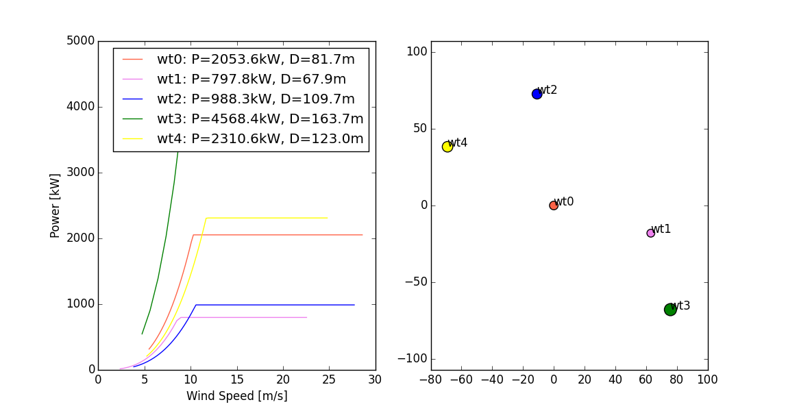

Energy Production Tutorials
----------------------------

This tutorial covers how to use FUSED-Wind's energy analysis framework for basic energy production analysis.

Tutorial for Basic_AEP
^^^^^^^^^^^^^^^^^^^^^^^^^^^^

As an example of Basic_AEP, let us simulate energy production for a land-based wind plant.  

The first step is to import the relevant files and set up the component.

.. literalinclude:: examples/Fused_flow_docs_example.py
    :start-after: # 1 ---
    :end-before: # 1 ---

The plant energy production model relies on some turbine as well as plant input parameters that must be specified.  Firstly the wind turbine power curve must be set along with the site hub height Weibull scale and shape factors.  There is no flow model so array losses and other turbine and plant losses must be directly set.  Finally the number of turbines is included as the AEP per turbine is calculated by the number of turbines in the plant to get the total energy production.

.. literalinclude:: examples/Fused_flow_docs_example.py
    :start-after: # 2 ---
    :end-before: # 2 ---

We can now evaluate the plant energy production.

.. literalinclude:: examples/Fused_flow_docs_example.py
    :start-after: # 3 ---
    :end-before: # 3 ---

We then print out the resulting energy production values.

.. literalinclude:: examples/Fused_flow_docs_example.py
    :start-after: # 4 ---
    :end-before: # 4 ---

The result is:

>>> Annual energy production for an offshore wind plant with 100 NREL 5 MW reference
 turbines.
>>> AEP gross output (before losses): 1570713782.2 kWh
>>> AEP net output (after losses): 1389359168.9 kWh

Tutorial for AEPMultipleWindRoses
^^^^^^^^^^^^^^^^^^^^^^^^^^^^^^^^^
First we create a test ``GenericWindFarmModel`` to emulate a wind farm flow model.
This model will just randomly create a power for the wind farm out of the wind farm layout given as input.

.. literalinclude:: ../src/fusedwind/examples/fused_plant_flow_example.py
    :start-after: # 1 ---
    :end-before: # 1 ---

Then we define a function that creates an ``AEPMultipleWindRoses`` instance and pass it the new ``MyTestWindFarm`` that
we just created. Here the wind turbine layout is randomly generated with the function ``generate_random_wt_layout()``

.. literalinclude:: ../src/fusedwind/examples/fused_plant_flow_example.py
    :start-after: # 2 ---
    :end-before: # 2 ---

Let's look at what it returns. It's an instance of the ``AEPMultipleWindRoses`` class, that has now some outputs:
``net_aep`` is the net AEP of the wind farm, and ``wt_aep`` is the AEP for each turbine.

.. literalinclude:: ../src/fusedwind/examples/fused_plant_flow_example.py
    :start-after: # 3 ---
    :end-before: # 3 ---

The result is (with our random numbers):

>>> Net AEP:  8080631217.75
>>> WT AEP: [  4.18783691e+08   2.39854533e+08   1.81198275e+09   2.59028985e+09 3.01972040e+09 ]

Now lets plot some things. Here we will plot on the left sub-plot all the power curves of the wind turbines in the layout
created, and on the right sub-plot, a scatter plot of the position of the turbine in the layout, and their
respective rotor size as a scale.

.. literalinclude:: ../src/fusedwind/examples/fused_plant_flow_example.py
    :start-after: # 4 ---
    :end-before: # 4 ---

Of course if you plot this yourself, it will probably be different, because the layout and turbines are randomly generated.

